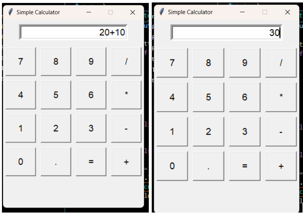
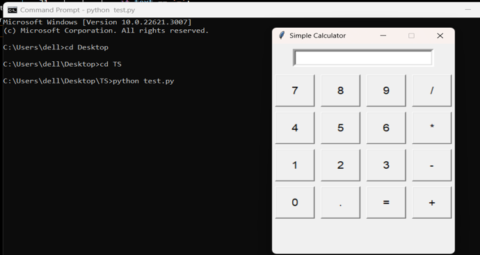
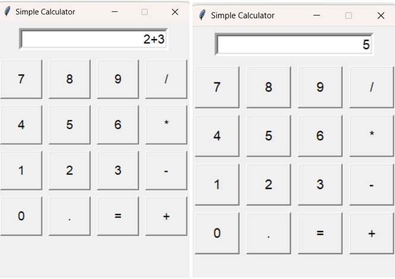
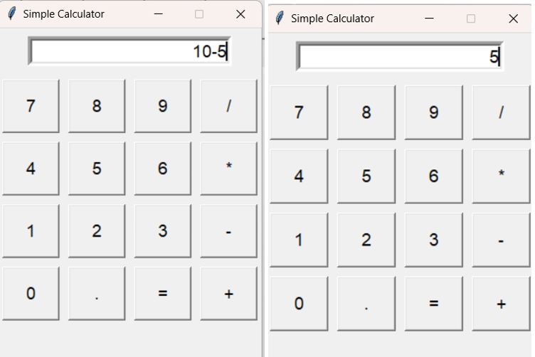
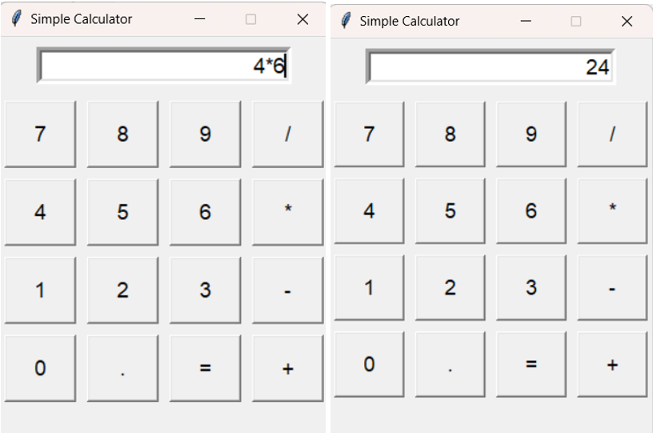
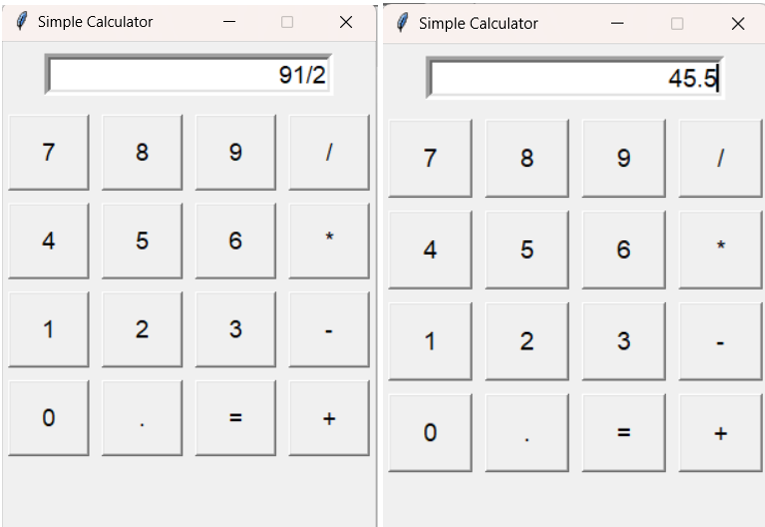
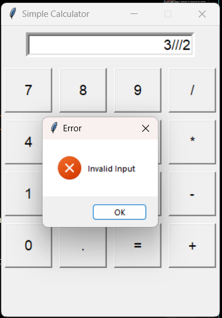
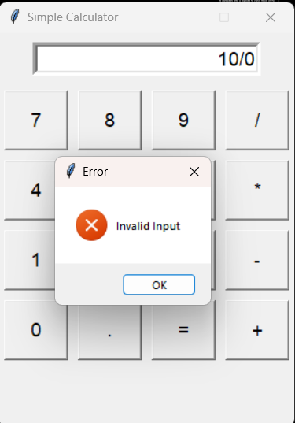

# Building a Calculator Using Tkinter in Python
<div align="justify">
In this section, we will walk through the process of building a simple calculator using Tkinter, a standard GUI (Graphical User Interface) toolkit for Python. Tkinter provides easy-to-use components for building graphical user interfaces, making it perfect for creating applications like calculators.

## What is Tkinter

The tkinter package ("Tk interface") is the standard Python interface to the Tcl/Tk GUI toolkit. Both Tk and tkinter are available on most Unix platforms, including macOS, as well as on Windows systems. Running this command `python -m tkinter` from the command line will open a window demonstrating a simple Tk interface, which will let you know if tkinter is properly installed on your system or not. Tkinter is not a thin wrapper, but adds a fair amount of its own logic to make the experience more pythonic. For more details, you can visit [Tkinter Documentation](https://docs.python.org/3/library/tkinter.html).

## Features
- **Simplicity:** Tkinter offers an easy-to-use interface for building GUI applications in Python.
- **Cross-Platform:** It works seamlessly across various operating systems, including Windows, macOS, and Linux.
- **Built-in Widgets:** Tkinter provides a wide range of widgets such as buttons, labels, entry fields, etc., for creating interactive interfaces.
- **Customization:** Widgets can be easily customized in terms of appearance and behavior to suit application requirements.
- **Event-Driven:** Tkinter follows an event-driven programming model, where user actions trigger events that are handled by event handlers.


## Creating the Calculator 
Now let us actually dive into the process of building the calculator using one step at a time.

### Step 1: Setting Up the Environment
Before we start building our calculator, ensure that you have Python installed on your system.
### For Windows:
1. Download and install Python from the [official website](https://www.python.org/downloads/)
2. Prefer this for the[ further steps in installation](https://www.tomshardware.com/how-to/install-python-on-windows-10-and-11)
2. Verify by running the following command:
   ```sh 
   python --version
   ```

### For Linux:
1. Prefer this for the [installation of python](https://phoenixnap.com/kb/how-to-install-python-3-ubuntu) 
   
    > **_TIPs:_**  Always update repository.
2. Verify by running the following command:
    ```sh 
        python --version
    ```
   
### For MacOs:
For reference [Steps to install python on MacOs](https://www.dataquest.io/blog/installing-python-on-mac/)
##

Next, we need to install Tkinter, which is included with Python by default. So, there's no need to install it separately

### Step 2: Importing Necessary Libraries
In Python, the tkinter module is used for creating GUI applications. 
Now let's import these required libraries along with other required modules:
```sh
    import tkinter as tk
    from tkinter import messagebox
```
### Explanation</ins>

**tkinter**: This module provides classes and functions for creating GUI applications.

**messagebox**: This submodule allows us to display message boxes for showing information or prompting the user for confirmation.

##
### Step 3: Creating the Calculator Class
create a class called Calculator that will represent our calculator application:
```sh
    class Calculator:
    def __init__(self, master):
        self.master = master
        self.master.title("Simple Calculator")
        self.master.geometry("300x400")
        self.master.resizable(False, False)
        self.create_widgets()

    def create_widgets(self):
        # Create entry widget for displaying input and results
        self.entry = tk.Entry(self.master, width=20, font=('Arial', 14), bd=5, justify="right")
        self.entry.grid(row=0, column=0, columnspan=4, padx=10, pady=10)

        # Define buttons
        buttons = [
            ('7', 1, 0), ('8', 1, 1), ('9', 1, 2), ('/', 1, 3),
            ('4', 2, 0), ('5', 2, 1), ('6', 2, 2), ('*', 2, 3),
            ('1', 3, 0), ('2', 3, 1), ('3', 3, 2), ('-', 3, 3),
            ('0', 4, 0), ('.', 4, 1), ('=', 4, 2), ('+', 4, 3)
        ]

        # Create buttons using a loop
        for (text, row, col) in buttons:
            button = tk.Button(self.master, text=text, width=5, height=2, 
            font=('Arial', 14), command=lambda t=text: self.on_button_click(t))
            button.grid(row=row, column=col, padx=5, pady=5)

```

### Explanation:


**Initialization:**


**Class Definition**: We define a class named Calculator that represents our calculator application.

**Initialization Method (__init__):** This method is called when a new instance of the Calculator class is created. It initializes the calculator's attributes and sets up the GUI window.

**master:** This parameter represents the parent window or container in which the calculator will be displayed.

**self.master.title("Simple Calculator"):** Sets the title of the GUI window to "Simple Calculator".

**self.master.geometry("300x400"):** Sets the dimensions of the GUI window to 300 pixels wide and 400 pixels high.

**self.master.resizable(False, False):** Prevents the GUI window from being resized both horizontally and vertically.

**self.create_widgets():** Calls the create_widgets() method to create the calculator's user interface.

**Widget Creation:**

The create_widgets method is responsible for creating the user interface elements of the calculator.

It first creates an Entry widget (self.entry) for displaying input and results. This widget is configured with a width of 20 characters, a font size of 14 points, a border width of 5 pixels, and text alignment to the right.
The Entry widget is placed in the window using the grid method, specifying its position in the grid layout.

Next, it defines a list of tuples named buttons, where each tuple represents the text, row, and column position of a button on the calculator.

Using a loop, it creates Button widgets for each button in the buttons list. Each button is configured with specific text, width, height, font, and a command that calls the on_button_click method with the button's text as an argument.

The Button widgets are also placed in the window using the grid method, positioning them according to their row and column values in the grid layout.
##
### Step 4: Implementing Button Click Functionality
Next, we define the on_button_click() method to handle button clicks:

```sh
   def on_button_click(self, text):
            if text == '=':
                try:
                    result = eval(self.entry.get())
                    self.entry.delete(0, tk.END)
                    self.entry.insert(tk.END, str(result))
                except Exception as e:
                    messagebox.showerror("Error", "Invalid Input")

            elif text == 'C':
                self.entry.delete(0, tk.END)

            else:
                self.entry.insert(tk.END, text)

```
### Explanation
**if text = = '=':** Checks if the button text is equal to '=' (the equal sign).

**result** = eval(self.entry.get()): Uses the eval() function to evaluate the mathematical expression entered in the entry widget (self.entry) and stores the result in the result variable.

**self.entry.delete(0, tk.END):** Clears the contents of the entry widget by deleting characters from index 0 to the end (tk.END).

**self.entry.insert(tk.END, str(result)):** Inserts the string representation of the result (str(result)) into the entry widget at the end (tk.END).

**except Exception as e:** Catches any exceptions that occur within the try block and assigns them to the variable e.

**messagebox.showerror("Error", "Invalid Input"):** Displays an error message box with the title "Error" and the message "Invalid Input" if an exception occurs during evaluation.

**elif text == 'C':** Checks if the button text is equal to 'C' (the clear button).

**self.entry.delete(0, tk.END):** Clears the contents of the entry widget when the 'C' button is clicked.

**self.entry.insert(tk.END, text):** Inserts the text of the clicked button into the entry widget at the end (tk.END), effectively appending it to the current input string.
##
### Step 5: Running the Application
Lastly, we need to create an instance of the Calculator class and run the main event loop:
```sh
   if __name__ == "__main__":
    root = tk.Tk()
    app = Calculator(root)
    root.mainloop()     

```
### Explanation
**if __name__ == "__main__":** This line checks whether the script is being run directly by the Python interpreter. When a Python script is executed, Python sets the special variable __name__ to "__main__" if the script is the main program being run. This condition ensures that the following code block is only executed if the script is being run directly.

**root = tk.Tk():** Creates a new instance of the Tkinter Tk class, which represents the main window or root window of the GUI application. This window serves as the container for all other GUI elements.

**app = Calculator(root):** Creates an instance of the Calculator class, passing the root window as an argument to the constructor. This initializes the calculator application within the root window.

**root.mainloop():** Enters the Tkinter event loop, which listens for events such as user input, button clicks, and window resizing. This function call blocks further execution of the script until the main window is closed by the user.

##
### Step 6: Results 
   
   

     

## Code snippet
```sh
     import tkinter as tk
     from tkinter import messagebox 

        class Calculator:
            def __init__(self, master):
                self.master = master
                self.master.title("Simple Calculator")
                self.master.geometry("300x400")
                self.master.resizable(False, False)
                self.create_widgets()
        # creating the widgets
                
            def create_widgets(self):
                # Create entry widget for displaying input and results
                self.entry = tk.Entry(self.master, width=20, font=('Arial', 14), bd=5, justify="right")
                self.entry.grid(row=0, column=0, columnspan=4, padx=10, pady=10)

                
                # Define buttons
                buttons = [
                    ('7', 1, 0), ('8', 1, 1), ('9', 1, 2), ('/', 1, 3),
                    ('4', 2, 0), ('5', 2, 1), ('6', 2, 2), ('*', 2, 3),
                    ('1', 3, 0), ('2', 3, 1), ('3', 3, 2), ('-', 3, 3),
                    ('0', 4, 0), ('.', 4, 1), ('=', 4, 2), ('+', 4, 3)
                ]

                # Create buttons using a loop
                for (text, row, col) in buttons:
                    button = tk.Button(self.master, text=text, width=5, height=2, font=('Arial', 14), command=lambda t=text: self.on_button_click(t))
                    button.grid(row=row, column=col, padx=5, pady=5)

        # funtion creation for on click feature
            def on_button_click(self, text):
                    if text == '=':
                        try:
                            result = eval(self.entry.get())
                            self.entry.delete(0, tk.END)
                            self.entry.insert(tk.END, str(result))
                        except Exception as e:
                            messagebox.showerror("Error", "Invalid Input")

                    elif text == 'C':
                        self.entry.delete(0, tk.END)

                    else:
                        self.entry.insert(tk.END, text)

        # main funtion is defined                # 
        if __name__ == "__main__":
            root = tk.Tk()
            app = Calculator(root)
            root.mainloop()                
```    

## Code Explanation or Working
1. When the calculator starts, it creates a window with an entry widget. This widget is where you can input numbers and view the results.

2. The calculator has buttons for digits 0-9, decimal point '.', and arithmetic operations like addition '+', subtraction '-', multiplication '*', and division '/'. These buttons are arranged in a grid layout.

3. When any button is clicked, it triggers the on_button_click function. If the button is an arithmetic operation or a digit, it adds that value to the entry widget. If the button is '=' (equal sign), it evaluates the expression in the entry widget and displays the result. If it's 'C' (clear), it clears the entry widget.

4. When '=' is pressed, it tries to evaluate the expression entered in the entry widget using Python's eval() function. If the expression is valid, it computes the result and displays it in the entry widget. If there's an error, such as invalid input or division by zero, it shows an error message.

5. The program keeps running in a loop, waiting for user interactions, until the window is closed.

5. Users can input numbers and perform arithmetic operations by clicking the respective buttons. They can clear the input by clicking 'C' and get the result by clicking '='.
   

## Testing and Debugging

**Basic Arithmetic Operations**
Test Input:

**Enter 2+3 =**



**Enter 10-5 =**



**Enter 4*6 =**



**Enter 8/2 =**



**Handling Invalid Input:**

Test Input:

**Enter 3///2=** (unsupported operation)



**Enter 10/0 =** (division by zero)



## Possible Errors that might occur

### Division by zero error:

**Problem**: If the user divides by zero, Python will raise a ZeroDivisionError.

**Solution**: Handle division by zero within the try-except block.
```sh
    try:
    result = eval(self.entry.get())
    if result == float('inf'):
        messagebox.showerror("Error", "Division by zero")
    else:
        self.entry.delete(0, tk.END)
        self.entry.insert(tk.END, str(result))
```
### Syntax error in evaluation:

**Problem**: If the user enters an invalid expression that can't be evaluated, it will raise a SyntaxError.

**Solution**: Catch SyntaxError and display an appropriate error message.
```sh
     except SyntaxError:
     messagebox.showerror("Error", "Invalid Expression")
```
### NameError due to undefined variable:

**Problem**: The code checks for the '=' and 'C' buttons, but they're not defined in the button list.

**Solution**: Add the '=' and 'C' buttons to the list with their respective positions.
```sh
    buttons = [
        ...
        ('=', 4, 2), ('C', 4, 0)
     ]
```
### Missing import statement:

**Problem**: The code uses messagebox without importing it.

**Solution**: Import messagebox from tkinter.
```sh
   from tkinter import messagebox
```
### Unsupported operations:

**Problem**: The calculator allows arbitrary evaluation of expressions `using eval()`, which can lead to unintended consequences.

**Solution**: Restrict the input to a certain format or implement a safer method for evaluation, such as parsing the expression manually.
Here's a safer approach to evaluate expressions using `ast.literal_eval()`:
```sh
   import ast

def evaluate_expression(self, expression):
    try:
        return ast.literal_eval(expression)
    except (SyntaxError, ValueError):
        raise ValueError("Invalid expression")

def on_button_click(self, text):
    if text == '=':
        try:
            result = self.evaluate_expression(self.entry.get())
            self.entry.delete(0, tk.END)
            self.entry.insert(tk.END, str(result))
        except ValueError as e:
            messagebox.showerror("Error", str(e))

```

### Advantages:

1. **Ease of Use:** Tkinter is a user-friendly `GUI toolkit for Python`, making it relatively easy to create simple graphical interfaces, such as a calculator.
2. **Cross-Platform:** Tkinter is platform-independent, which means the calculator application is able to work on different operating systems without major modifications.
3. **Integration with Python:** Since Tkinter is part of the standard library that Python has pre-installed, you don't need to install additional packages to use it. This makes it convenient and ensures compatibility with most Python.
4. **Customization:** Tkinter provides a range of widgets and options for customizing the appearance of the calculator that you build. You can design a user interface that suits well to your preferences and requirements.
### Disadvantages:
1. **Limited Aesthetics:** While using Tkinter ther is an issue with the appearance, which might be considered less modern as compared to some other GUI frameworks. If you need a highly polished and modern-looking interface, you might consider other frameworks.
2. **Limited Functionality:** While Tkinter is suitable for simple applications like a calculator, it might not contain the libraries that are used to build more complex or feature-rich applications.
3. **Steep Learning Curve for Advanced Features:** While it's easy to get started with the basics of Tkinter functionality, it becomes hard to master the advanced features and creating complex interfaces.
4. **Not the Trendiest Choice:** Some developers prefer more modern and feature-rich GUI libraries, such as `PyQt` or `Kivy`. Tkinter might be less fashionable or powerful for certain types of application's GUI.
### Good Programming Practices for Tkinter
When working with Tkinter, adhering to good programming practices ensures that your code is organized, maintainable, and efficient. Some recommended practices are as follows:

- Modularize Your Code: Break your GUI application into smaller, reusable components. Breaking it into smaller, reusable parts makes it easier to work with.
- Use Descriptive Variable Names: Choose meaningful names for variables, functions, and widgets to enhance code readability. This helps you and others to understand the purpose of each component.
- Organize Your Layout: Using Tkinter's layout managers such as `pack()`, `grid()`, or `place()`, effectively organizes your widgets within the window and ensures a consistent and visually appealing layout.
- Handle Events Properly: Implement event handling using Tkinter's event-driven model and use event bindings or command callbacks to respond to user interactions.
- Error Handling: Implement error handling to gracefully handle unexpected errors and exceptions. Use `try` and `except` blocks to catch and handle exceptions, and provide informative error messages to the user when applicable.

## Conclusion:
In conclusion, developing a simple calculator `using Tkinter in Python` offers a practical introduction to GUI application development. Tkinter's intuitive design, coupled with its `cross-platform compatibility` ,empowers developers to create interactive interfaces effortlessly. By leveraging Tkinter's event-driven model, we constructed a calculator with basic arithmetic operations, error handling, and clear functionality. Utilizing widgets like Entry and Button, we orchestrated a user-friendly interface, enhancing accessibility and user experience.

Throughout the process, we capitalized on `object-oriented programming` principles, encapsulating functionality within the Calculator class.</span> This modular approach facilitates code organization and maintenance, promoting scalability and extensibility. Moreover, the integration of error handling mechanisms, such as `try-except blocks` and message boxes, underscores the importance of robustness in software design. These measures ensure graceful handling of unexpected inputs, enhancing the calculator's reliability and user confidence.</p>

By adhering to best practices and leveraging Tkinter's capabilities, we've crafted a functional calculator application that demonstrates the synergy between `Python's versatility and Tkinter's simplicity`. This endeavor serves as a springboard for aspiring developers to delve deeper into GUI programming and explore the myriad possibilities of Python's ecosystem.


  
   

